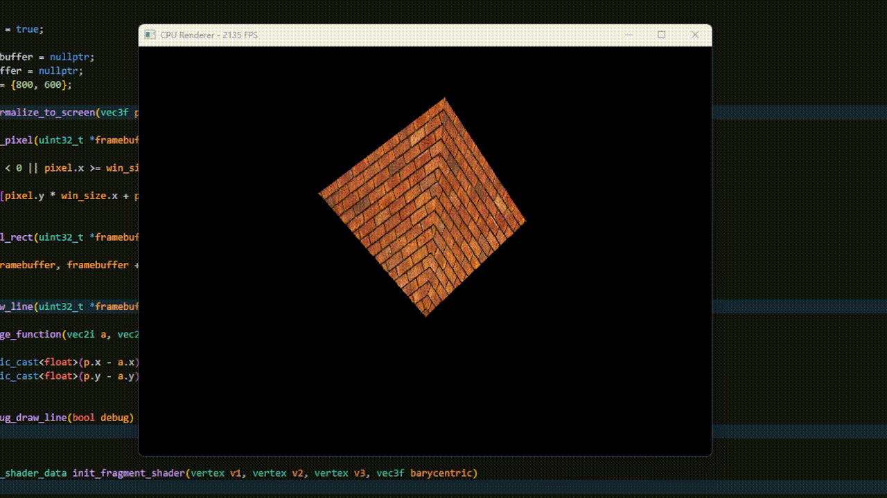
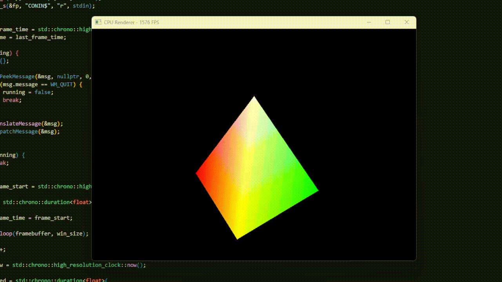
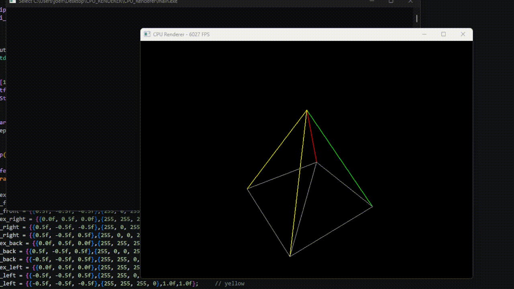
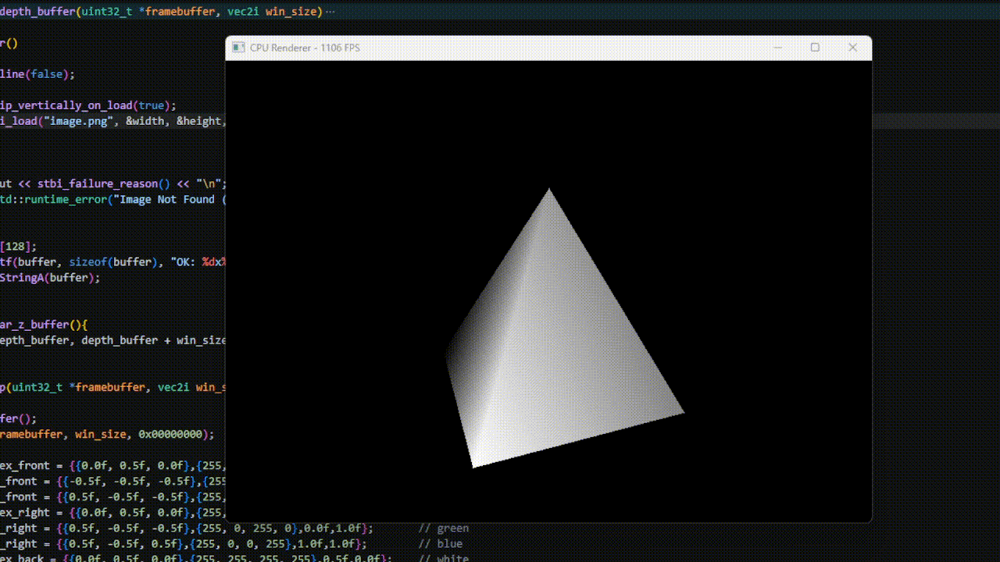
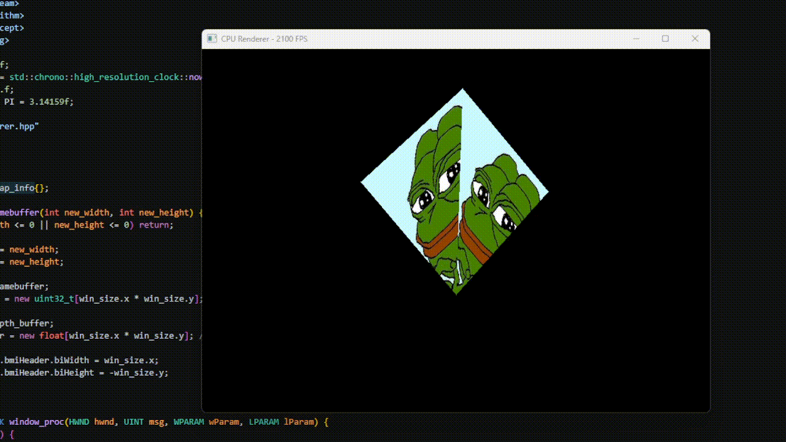

# CPU Renderer

A tiny software 3D renderer written in C++ for Windows. No OpenGL, no DirectX, no Vulkan: every vertex is transformed, every triangle is rasterized and every pixel is shaded on the **CPU**, then blitted to a Win32 window. Textures are loaded with [`stb_image`](https://github.com/nothings/stb).

I made this because Im really intrested in 3D rendering so tried to figure out how does it work

The demo scene is a **spinning, textured pyramid**.

<!-- ============================================================
     PICTURE SLOT 1 — HERO IMAGE / GIF
     Suggested: a GIF of the pyramid spinning (~800x600)
     Save as: docs/images/hero.gif
     ============================================================ -->
<p align="center">
  
</p>

---

## Table of contents

- [Features](#features)
- [Gallery](#gallery)
- [Requirements](#requirements)
- [Getting started](#getting-started)
- [User guide](#user-guide)
- [How it works](#how-it-works)
- [Code map](#code-map)
- [Known limitations](#known-limitations)
- [Troubleshooting](#troubleshooting)
- [Credits](#credits)

---

## Features

- Fully CPU-based rasterizer (single-threaded, single translation unit)
- Custom `mat4` / `vec3f` math: translate, scale, rotate X/Y/Z, perspective projection
- Triangle rasterization with **edge functions** and **barycentric coordinates**
- **Z-buffer** (depth testing) so faces occlude each other correctly
- **Texture mapping** from any image `stb_image` can load (PNG, JPG, BMP, TGA, ...)
- **Wireframe debug mode** using Bresenham's line algorithm
- **Depth buffer visualizer** (grayscale) for debugging
- Resizable window: framebuffer and depth buffer are reallocated on resize
- Live FPS counter in the window title

---

## Gallery

| Color (No texture) | Wireframe (debug mode) |
| :---: | :---: |
| <!-- PICTURE SLOT 2 -->  | <!-- PICTURE SLOT 3 -->  |
| `docs/images/color.gif` | `docs/images/wireframe.gif` |

| Depth buffer view | Custom texture |
| :---: | :---: |
| <!-- PICTURE SLOT 4 -->  | <!-- PICTURE SLOT 5 -->  |
| `docs/images/depth.gif` | `docs/images/custom-texture.gif` |


---

## Requirements

| Requirement | Notes |
| --- | --- |
| **Windows 7+** | Uses the Win32 API (`windows.h`, `StretchDIBits`) |
| **C++17 compiler** | MSVC (Visual Studio 2019+) or MinGW-w64 (GCC) |
| **`stb_image.h`** | Single header from [nothings/stb](https://github.com/nothings/stb) |
| **`image.png`** | Any image to use as the texture; must be next to the executable |

---

## Getting started

### 1. Project layout

```
cpu-renderer/
├── main.cpp          # Win32 window, main loop, framebuffer management
├── renderer.hpp      # Math, rasterizer, shaders, scene
├── stb_image.h       
├── image.png         # (texture)
└── docs/
    └── images/      
```

### 2. Get `stb_image.h`

Download `stb_image.h` from <https://github.com/nothings/stb> and place it next to `main.cpp`.

You do **not** need to add any define yourself: `renderer.hpp` already contains `#define STB_IMAGE_IMPLEMENTATION` before including the header.

### 3. Add a texture

Put an image named exactly **`image.png`** in the folder the program runs from (see [Troubleshooting](#troubleshooting)). Any size works; it is always loaded as 3-channel RGB.

### 4. Build

**MSVC** (open *x64 Native Tools Command Prompt for VS*):

```bat
cl /std:c++17 /O2 /EHsc main.cpp /link user32.lib gdi32.lib /SUBSYSTEM:WINDOWS /OUT:renderer.exe
```

**MinGW-w64**:

```bash
g++ -std=c++17 -O2 main.cpp -o renderer.exe -mwindows -luser32 -lgdi32
```

**Visual Studio project**: create an empty *Windows Desktop Application* project, add `main.cpp` and `renderer.hpp`, and set:

- C++ Language Standard: **C++17**
- Configuration: **Release** for real speed (Debug is *much* slower for a software renderer)
- Character Set: **Not Set** or **Multi-Byte**, because the code uses the ANSI (`A`) Win32 functions

> Build commands above are the standard ones for this kind of single-file Win32 project. Adjust them to your toolchain if needed.

### 5. Run

```bat
renderer.exe
```

A window opens showing the textured pyramid rotating. The FPS shows in the title bar.

---

## User guide

### What you'll see

A pyramid (square base, four triangular sides) rotating around the Y and X axes at 60 degrees per second. Each face shows the full texture.

<!-- PICTURE SLOT 8 — optional: annotated screenshot pointing at the window, title bar FPS, and the pyramid -->

### Controls

| Action | Result |
| Press "D" | See Depth Buffer |
| Resize the window | Framebuffer and depth buffer are recreated; aspect ratio updates automatically |
| Close the window | Exits cleanly |

### Changing the texture

Replace `image.png` with any image. The renderer will stretch it across every face. Since `stbi_set_flip_vertically_on_load(true)` is enabled, the image loads bottom-up so `v = 0` is the top of the picture in the UV layout used here.

To load a different file name or format, edit this line in `init_render()`:

```cpp
image = stbi_load("image.png", &width, &height, &channels, 3);
```

### Wireframe / debug mode

`init_render()` turns debug mode off at startup:

```cpp
void init_render()
{
    debug_draw_line(false);   // change to true for wireframe
    ...
}
```

Set it to `true` and rebuild. Triangles are drawn as colored outlines (one color per face) instead of being filled and textured, and a console window opens for `stdout` / `stderr`.

<!-- PICTURE SLOT 9 — optional: side by side of debug off vs on -->

### Viewing the depth buffer

`visualize_depth_buffer()` converts the z-buffer into a grayscale image (closer is brighter). It is not called by default. To use it, add a call at the end of `render_loop()`:

```cpp
    draw_triangle(framebuffer, win_size, t_b1_base, t_b3_base, t_b4_base, 0xFF888888);

    visualize_depth_buffer(framebuffer, win_size);   // <- add this
}
```

### Tweaking the scene

All of these live in `render_loop()` in `renderer.hpp`:

| What | Where | Example |
| --- | --- | --- |
| Rotation speed | `angle += 60.0f * delta;` | `120.0f` for twice as fast |
| Rotation axes | `model = rotate_y(angle) * rotate_x(angle)` | Add `rotate_z(angle)` |
| Camera distance | `mat4::translate(0.0f, 0.0f, 2.0f)` | Larger `z` moves the object farther away |
| Field of view | `mat4::perspective(60.0f, ...)` | `90.0f` for a wide-angle look |
| Near / far planes | `perspective(..., 0.1f, 100.0f)` | Adjust clipping distances |
| Object scale | Multiply `model` by `mat4::scale(sx, sy, sz)` | `mat4::scale(2, 1, 2)` |
| Initial window size | `vec2i win_size = {800, 600};` | Any size |
| Background color | `fill_rect(framebuffer, win_size, 0x00000000);` | `0xFF202030` (ARGB) |

### Drawing your own geometry

1. Create `vertex` values. Each one is `{position, color, u, v}`:

   ```cpp
   vertex a = {{ 0.0f,  0.5f, 0.0f}, {255, 255, 255, 255}, 0.5f, 0.0f};
   vertex b = {{-0.5f, -0.5f, 0.0f}, {255, 255, 255, 255}, 0.0f, 1.0f};
   vertex c = {{ 0.5f, -0.5f, 0.0f}, {255, 255, 255, 255}, 1.0f, 1.0f};
   ```

   (`color` is `{a, r, g, b}`.)

2. Transform each vertex position with the MVP matrix:

   ```cpp
   a.position = a.position.transform(mvp);
   ```

3. Draw it:

   ```cpp
   draw_triangle(framebuffer, win_size, a, b, c, 0xFFFFFFFF);
   ```

   The last argument is the wireframe color, used only when debug mode is on.

---

## How it works

Each frame goes through this pipeline:

```
  Vertices (model space)
          │
          ▼   model = rotate_y * rotate_x
  World space
          │
          ▼   view = translate(0, 0, 2)
  View space
          │
          ▼   proj = perspective(60°, aspect, 0.1, 100)
  Clip space  ──► divide by w ──► NDC  (-1..1)
          │
          ▼   normalize_to_screen()
  Screen pixels
          │
          ▼   bounding box + edge functions → barycentric weights
  For every pixel inside the triangle:
          │   ├─ interpolate depth → z-buffer test (keep the nearest)
          │   ├─ interpolate UV
          │   └─ fragment_shader() → texture lookup
          ▼
  framebuffer[] ──► StretchDIBits ──► window
```

Some details worth knowing:

- **Matrix convention:** row vectors (`v * M`), so the combined matrix is built as `model * view * proj`.
- **Z-buffer:** cleared to `1e9` every frame; a pixel is drawn only if its depth is *smaller* than the stored one.
- **Texture sampling:** nearest-neighbor, with coordinates clamped to the image bounds.
- **Timing:** `delta` is measured per frame in `main.cpp`, so rotation speed is independent of frame rate.
- **Pixel format:** `0xAARRGGBB`, matching a 32-bit top-down DIB (`biHeight` is negative).

---

## Code map

| File | Symbol | Purpose |
| --- | --- | --- |
| `main.cpp` | `WinMain` | Creates the window, runs the message loop, calls `render_loop`, blits the framebuffer, updates the FPS title |
| `main.cpp` | `resize_framebuffer` | Reallocates framebuffer + depth buffer and updates the bitmap header on resize |
| `main.cpp` | `window_proc` | Handles `WM_SIZE`, `WM_CLOSE`, `WM_DESTROY` |
| `renderer.hpp` | `mat4` | 4x4 matrix with translate / scale / rotate / perspective |
| `renderer.hpp` | `vec3f`, `vec2i`, ... | Vector types; `vec3f::transform` applies a matrix and perspective divide |
| `renderer.hpp` | `draw_line` | Bresenham line, used by wireframe mode |
| `renderer.hpp` | `draw_triangle` | Rasterizer: edge functions, z-test, shading |
| `renderer.hpp` | `init_fragment_shader` | Interpolates UV and color with barycentric weights |
| `renderer.hpp` | `fragment_shader` / `texture_mapping` | Looks up the texture color for a pixel |
| `renderer.hpp` | `visualize_depth_buffer` | Draws the z-buffer as grayscale |
| `renderer.hpp` | `init_render` | Loads the texture, sets debug mode |
| `renderer.hpp` | `render_loop` | Builds the scene, transforms vertices, draws every face |

> `main.cpp` defines `PI`, `delta` and friends **before** including `renderer.hpp`, and `renderer.hpp` relies on them. Keep that include order.

---

## Known limitations

This is a learning project, so some things are intentionally simple (maybe some day I'll add this):

- **Windows only** (Win32 API)
- **No near-plane clipping:** triangles crossing the camera plane can render incorrectly
- **No perspective-correct interpolation:** textures are interpolated in screen space, so large faces close to the camera can look slightly warped
- **No back-face culling:** both sides of every triangle are drawn
- **Vertex colors are interpolated but unused** by the current fragment shader (the multiply lines are commented out)
- **No lighting**, no mipmaps, no texture filtering
- **Single-threaded**


---

## Troubleshooting

**The program crashes or closes immediately on start**
`init_render()` throws if `image.png` can't be loaded. Make sure the file exists in the program's **working directory**. When launching from Visual Studio, that's the project folder by default, not the folder containing the `.exe`. The `stb_image` failure reason is printed to the console if one is open.

**`cannot open source file "stb_image.h"`**
The header isn't in the include path. Put it next to `main.cpp`.

**Linker errors about `WinMain`, `CreateWindowExA`, `StretchDIBits`, ...**
Link against `user32` and `gdi32`, and build as a **Windows** (not Console) subsystem app.

**Garbled window title in Visual Studio**
Set *Project Properties → Advanced → Character Set* to **Not Set** or **Multi-Byte**.

**Low FPS**
Build in **Release** with optimizations (`/O2` or `-O2`), and try a smaller window: cost scales with the number of pixels.

---

## Credits

- [`stb_image`](https://github.com/nothings/stb) by Sean Barrett (public domain / MIT)
- Rasterization approach based on the classic edge-function / barycentric method

## License

No license lol
